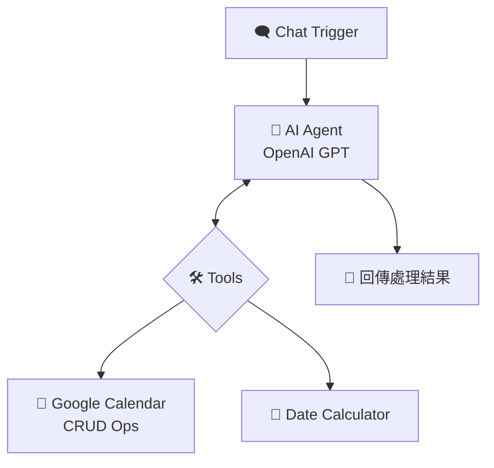

# 📅 n8n AI Agent: Google Calendar 智能小幫手

這是一個整合了 AI Agent 技術的 n8n 自動化工作流。透過與 OpenAI GPT 模型及 Google Calendar API 的深度結合，使用者可以用自然語言輕鬆管理行事曆，無需手動點選複雜的介面。

## 📖 流程簡介

本專案利用 AI Agent 的「推理能力」與「工具調用 (Tool Calling)」功能，實現了以下自動化邏輯：
1. **觸發層**：透過 n8n Chat 接收指令（如：「幫我約明天下午三點與小明開會」）。
2. **推理層 (Agent)**：AI 自動計算當前日期，並判斷指令意圖。
3. **執行層 (Tools)**：根據判斷結果，自動調用 Google Calendar 進行新增、查詢、更新或刪除事件。

### 核心節點配置
* **When chat message received**: 接收對話輸入，並作為 Agent 的啟動點。
* **AI Agent (OpenAI)**：
    * **核心指令**：內建「緊急執行」規則，確保 AI 會先根據目前日期推算「明天」或「下週」的精準日期。
    * **日期計算**：整合 `date_calculator` 工具，處理跨月與星期的數學推算。
* **Google Calendar 工具**：
    * **CRUD 支援**：支援建立 (C)、讀取 (R)、更新 (U) 與刪除 (D) 操作。
    * **全天/時間判斷**：精準區分 `allday` 事件與特定時間點事件。

## 🛠️ 安裝與使用

### 1. 匯入工作流
下載本倉庫中的 `google-calendar-agent-template.json` 檔案，並在您的 n8n 面板選擇 **"Import from File"** 進行匯入。

### 2. 設定憑證 (Credentials)
本工作流需要配置兩組憑證：
* **OpenAI API**：用於驅動 AI Agent 進行推理。
* **Google Calendar OAuth2**：用於讀取與修改您的 Google 行事曆。

### 3. 開始使用
點擊 n8n 畫面下方的 **"Open chat"**，嘗試輸入：
* 「幫我看看今天下午有什麼安排？」
* 「下週二整天要出差，幫我記下來。」
* 「取消明天三點的那個會議。」

## 📊 流程結構

使用 Markdown 內建的 Mermaid 語法呈現流程邏輯：

## 📸 執行截圖範例

*圖：AI Agent 根據當前日期成功推算並完成行事曆預約。*
